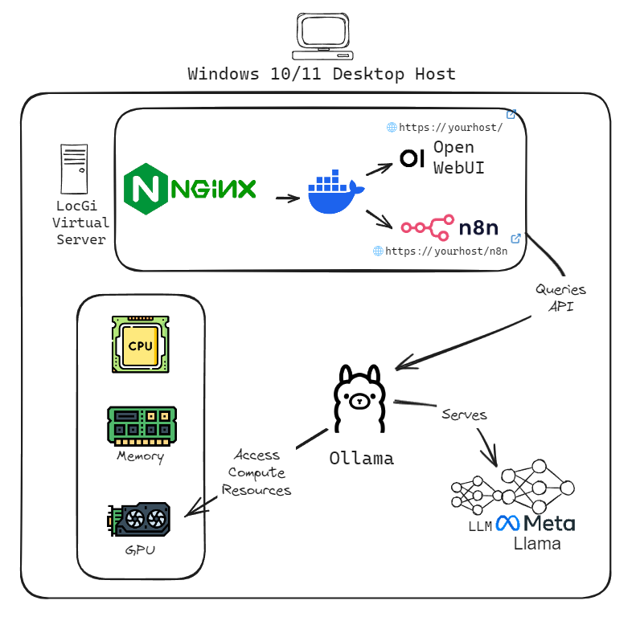
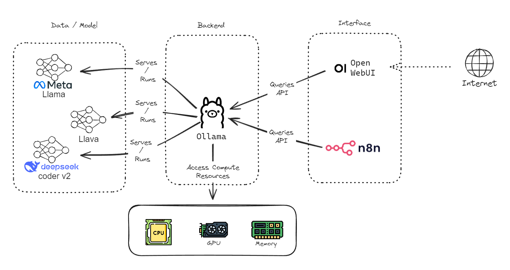

# LocGi
AI and LLM's are all the rage, but I wanted Private AI. Here's the problem, I don't want to spend tons on cloud-based infrastructure, and I don't have a spare machine.... but what I do have is a reasonably powerful gaming PC, built on Windows 10. It's prefect for AI.

LocGI is an attempt at bootstrapping a local, private AI instance on a modern Windows Gaming PC, that allows you to start services on boot and for use within the rest of your local network and on the public internet

This repo contains scripts to help install, operate and maintain your local instance. 

# Architecture

LocGI's architecture is intended to keep all the key components on the same physical hardware, by making use of different layers of virtualisation.

A host windows machine runs Ollama as backend service, and runs a VM (called LocGI) on virtualbox, which itself hosts front-end and API applications (OpenWeb UI and N8N). Those applications are further protected by Nginx as a reverse proxy, with TLS allowing for a reasonably secure setup which won't directly compromise your main gaming machine (host) in the event of cyber attack

# Installation
 
## Dependencies
- VirtualBox https://www.virtualbox.org/wiki/Downloads
- Non-Sucking Service Manager https://nssm.cc/download
    - NOTE: This repo includes a script to install NSSM if you don't already have it.

## Steps
1. Download and Install Virtualbox https://www.virtualbox.org/wiki/Downloads
2. Set your desired Ollama installation variables in `ollama-variables.ps1`
3. Run (in admin powershell) ollama-server-install.ps1
5. Create and setup an ubuntu virtual machine with at least 2 vCPUs, 4gb of RAM and 40gb of disk space. Ensure that the network is bridged (rather than NAT)
6. Copy over contents from from locgi-vm-config-and-scripts folder into the vm
5. Create a task in windows task scheduler to start vm on machine start
7. In the vm run locgi-setup.sh

